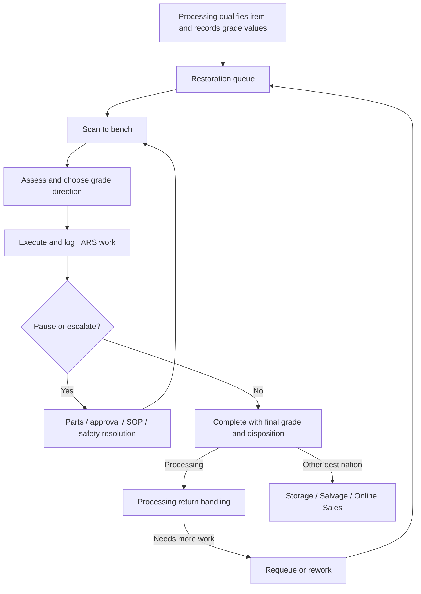

<!-- Last updated: 2026-07-10 (Phase 0 evidence closed; canon + Phase 1 handoff approved) -->

# TARS Phase 0 — Discovery Workbook

**Status:** **Phase 0 complete.** Evidence record closed 2026-07-10. The original direct-Ashley pre-acceptance checkpoint was retired by Bill when he accepted the functioning Phase 1 MVP; live use now feeds continuous improvement instead of blocking functionality.

**Initiative:** [`tars_full_instruction_wizard_guidance`](../../initiatives/tars_full_instruction_wizard_guidance.md)

**Final synthesis:** [`phase_0_process_canon.md`](./phase_0_process_canon.md)

---

## Confirmed discovery setup

- **Method:** Owner walkthrough plus representative staff observation/interviews.
- **Final approval:** Owner and Restoration lead jointly.
- **Owner/product builder:** Bill Rollins — Owner/CEO, superuser; designs/builds the dashboard and guardrails; orders parts.
- **Restoration:** Mike — Lead Restoration and currently the only Restoration performer.
- **Processing:** Ashley — Lead Processor, with additional processors under her.
- **Transactional source of truth:** Existing `RestorationJob` workflow; Phase 0 does not change code or data.
- **Required perspectives:** Bill, Mike, Ashley, and representative processors.
- **Evidence rule:** Keep **as-is behavior**, **as-intended policy**, and **future product ideas** separate.

### Product direction correction

The target is **not** primarily an SOP or formal-document library. It is an in-dashboard operational structure that:

- gives Ashley guardrails for Processing handoff and grade/value context;
- gives Mike a worksheet/template for tests, evaluation, grade direction, action, salvage, holds, and completion;
- saves item-level evidence, work, decisions, and reasons;
- reuses test types, grade scales, rules of thumb, instructions, steps/phases, and decision methods;
- helps different people reach similar decisions from similar evidence;
- lets Bill improve the reusable structure from actual saved work and exceptions.

---

## How to use this workbook

1. Start with the code-derived process and contradiction register below.
2. Walk a real or representative item end to end with the Owner.
3. Observe Processing and Restoration staff doing the same work without coaching them toward the code model.
4. Record hidden/offline steps, terms, decisions, uncertainty, workarounds, and escalation.
5. Resolve each contradiction as:
   - **confirmed process**;
   - **intended policy change**;
   - **guidance/training need**;
   - **transactional product gap**;
   - **data/measurement gap**; or
   - **not applicable**.
6. Promote approved conclusions into the process canon. Keep raw evidence and disagreement here.

---

## Code-derived evidence map

| Area | Current code behavior to validate | Primary evidence |
|------|-----------------------------------|------------------|
| Processing handoff | `dispatch=restoration` creates a job with a grade scale and positive per-grade values; check-in quantity is one. | [`processing_ops.py`](../../../apps/inventory/processing_ops.py), [`restoration.py`](../../../apps/inventory/services/restoration.py) |
| Queue entry | Staff can add eligible items by scan; sold/lost/scrapped/salvage or missing-PO cases are rejected. | [`restoration.py`](../../../apps/inventory/services/restoration.py), [`TarsIntakePanel.tsx`](../../../frontend/src/pages/restoration/tars/TarsIntakePanel.tsx) |
| Queue work | Staff can edit grade values while queued, split/combine eligible jobs, check into the bench, or return eligible work. | [`TarsQueuePage.tsx`](../../../frontend/src/pages/restoration/tars/TarsQueuePage.tsx), [`test_restoration_queue.py`](../../../apps/inventory/tests/test_restoration_queue.py) |
| Bench check-in | Queued/sent/pending jobs with complete values can enter the bench; multi-item stacks must be split. | [`restoration_bench.py`](../../../apps/inventory/services/restoration_bench.py), [`TarsWorkstation.tsx`](../../../frontend/src/pages/restoration/tars/TarsWorkstation.tsx) |
| Assessment | Staff select/evaluate grade direction and can estimate grade-scoped time/parts. | [`TarsGradeDirectionCards.tsx`](../../../frontend/src/pages/restoration/tars/TarsGradeDirectionCards.tsx), [`TarsGradeEvalDialog.tsx`](../../../frontend/src/pages/restoration/tars/TarsGradeEvalDialog.tsx) |
| Work record | The current UI writes free-form `benchRows` categorized as Test / Assemble / Repair / Salvage; old verb panels are not live. | [`TarsWorkBenchTable.tsx`](../../../frontend/src/pages/restoration/tars/TarsWorkBenchTable.tsx), [`tarsWorkTypes.ts`](../../../frontend/src/pages/restoration/tars/tarsWorkTypes.ts) |
| Timer | One running Restoration timer per user; another timer is paused when switching; HR break/clock-out pauses it. | [`restoration_bench.py`](../../../apps/inventory/services/restoration_bench.py), [`TarsBenchTimer.tsx`](../../../frontend/src/pages/restoration/tars/TarsBenchTimer.tsx) |
| Holds | Bench work can move to pending with a controlled reason, storage location, and notes. | [`TarsHoldDialog.tsx`](../../../frontend/src/pages/restoration/tars/TarsHoldDialog.tsx), [`restoration_bench.py`](../../../apps/inventory/services/restoration_bench.py) |
| SOP/safety escalation | `research_sop`, `safety_hold`, and `needs_approval` exist as hold reasons but do not route to a named resolver. | [`tarsWorkTypes.ts`](../../../frontend/src/pages/restoration/tars/tarsWorkTypes.ts), [`restoration_bench.py`](../../../apps/inventory/services/restoration_bench.py) |
| Parts | A grade plan can produce a parts request; Mike identifies/submits the need and Bill is the intended parts orderer. | [`TarsPartsListPanel.tsx`](../../../frontend/src/pages/restoration/tars/TarsPartsListPanel.tsx), [`TarsPartsRequestsPage.tsx`](../../../frontend/src/pages/restoration/TarsPartsRequestsPage.tsx) |
| Completion | Bench/pending work completes with final grade, disposition, hours, parts cost, and notes. | [`TarsDoneDialog.tsx`](../../../frontend/src/pages/restoration/tars/TarsDoneDialog.tsx), [`restoration_bench.py`](../../../apps/inventory/services/restoration_bench.py) |
| Downstream | Completion can send an item to Processing, Storage, Salvage, or Online Sales; selected Processing returns need handling. | [`RestorationsPage.tsx`](../../../frontend/src/pages/inventory/restorations/RestorationsPage.tsx), [`views.py`](../../../apps/inventory/views.py) |
| Rework | Re-scanning a done/returned job requeues it and clears prior lifecycle/work state. | [`restoration.py`](../../../apps/inventory/services/restoration.py), [`test_restoration_queue.py`](../../../apps/inventory/tests/test_restoration_queue.py) |
| Permissions | Most Restoration APIs are staff-wide; Parts Requests is Manager/Admin in nav but staff-wide in API. | [`views.py`](../../../apps/inventory/views.py), [`navItemCatalog.ts`](../../../frontend/src/navigation/navItemCatalog.ts) |
| Metrics | Dashboard exposes WIP, pending/returns, throughput, and verb counts; current verb counts read legacy `actions`, not live `benchRows`. | [`dashboard_metrics.py`](../../../apps/pos/services/dashboard_metrics.py), [`test_dashboard_metrics.py`](../../../apps/pos/tests/test_dashboard_metrics.py) |

---

## Current-state workflow hypothesis

**Approved direction:** Staff check queued items directly into the bench. The human process does not require a separate “sent” step; the leftover model/API state is a transactional cleanup candidate.

---

## Contradiction and validation register

| ID | Question to validate | Code-derived signal | Decision owner | Status / evidence |
|----|----------------------|---------------------|----------------|-------------------|
| **C01** | Is `sent` a real handoff step, or is queued → bench now canonical? | Send API exists; no current frontend caller found. | Bill + Mike | **Resolved:** queued → bench; `sent` is obsolete for the human process. |
| **C02** | Do staff consistently log Test/Assemble/Repair/Salvage in Work Bench rows? | UI writes `benchRows`; dashboard counts legacy `actions`. | Mike | **Resolved direction:** Work Bench/guardrail record is authoritative; production has 2 `benchRows`, 0 legacy `actions`; dashboard metric is invalid. |
| **C03** | Does a technician see and act on “parts received” reliably? | Backend writes a flag; session merge may omit it. | Mike | **Transactional gap:** only one draft request exists; validate Mike receipt/resume in Phase 1 when exercised. |
| **C04** | Who may submit, order, approve, and receive parts? | Manager-only nav; staff-wide API. | Bill + Mike | **Resolved policy:** Mike identifies/submits; Bill approves/orders. Receiving handoff still needs workflow validation. |
| **C05** | Who owns and resolves `needs_approval`, `research_sop`, and `safety_hold`? | Reasons park the job but do not route work. | Bill + Mike | **Resolved authority:** Mike resolves ordinary approval/research; safety requires Mike + Bill clearance. Routing/product behavior remains open. |
| **C06** | What is the correct abort/misroute path after an item reaches the bench? | Queue has return actions; bench primarily completes to a disposition. | Mike + Ashley | **Resolved policy:** return to Processing with required reason and preserved history; product gap if bench cannot do this cleanly. |
| **C07** | Who may create grade scales and who owns grade-dollar values? | Staff-wide scale API; Processing normally supplies values. | Bill + Mike | **Resolved policy:** Ashley/Processing sets initial values; Mike resolves corrections with Ashley; Manager+/Bill controls scale definitions. |
| **C08** | What physically happens when a completed/returned job is rescanned? | Requeue resets system state; prior item location may differ. | Mike | **Policy resolved:** re-entry is rework and prior history/reason must persist; current reset behavior is a transactional gap. |
| **C09** | What constitutes rework for reporting and coaching? | Returned, Processing return, and requeue are distinct signals. | Bill + Mike | **Resolved definition:** any completed or returned item that re-enters Restoration. Instrumentation still open. |
| **C10** | Does “awaiting parts” mean all pending jobs or only parts holds? | Dashboard currently counts every pending job. | Bill | **Resolved definition:** parts-only; current metric is misleading and not used for Phase 1. |
| **C11** | Are existing verb counts trusted or used for decisions? | Current metric shape may not match current work log. | Bill | **Resolved:** not trusted; 0 recent legacy `actions`; do not use until aligned. |
| **C12** | How are legacy multi-item stacks handled on the floor? | New handoff is quantity one; older stacks may require split. | Mike | **Not a current constraint:** production has 0 multi-quantity Restoration jobs; retain split behavior for legacy edge cases. |

---

## Participants and evidence sessions

| Role | Participant | Required evidence | Date | Complete |
|------|-------------|-------------------|------|----------|
| Owner | **Bill Rollins** | End-to-end walkthrough; product/business guardrails; metrics; final approval | 2026-07-10 | Complete |
| Restoration lead / current performer | **Mike** | Evaluation, decisions, exceptions, escalation, parts need, safety; final approval | Joint observed-practice input represented 2026-07-10 | Complete |
| Processing lead | **Ashley** | Handoff, grade/value setup, processor guardrails, restoration returns | Current practice represented by Bill + Mike: scale/values are usually complete/consistent; live feedback enters CI | Post-acceptance observation |
| Other Processing staff | Ashley's team | Usability/consistency feedback during normal use | Continuous improvement | Deferred |
| Future Restoration staff | Not currently staffed | Consistency is a design goal; do not invent current observations | Deferred | N/A |

---

## Owner walkthrough agenda

Walk one representative item end to end. Demonstrate the current process where possible; describe policy separately.

### Decisions captured — 2026-07-10

| Decision | Approved direction | Authority / evidence |
|----------|--------------------|----------------------|
| Product form | In-dashboard guardrail/worksheet/template and saved decision system; formal SOP documents are not the priority. | Bill owner direction; applies across initiative/phases. |
| Initial people | Bill builds/owns guardrails and orders parts; Mike runs Restoration; Ashley leads Processing and her processors. | Bill owner direction. |
| Process approval | Bill + Mike jointly approve TARS process; Ashley validates Processing behavior. | Confirmed discovery setup. |
| Queue handoff | Queued items check directly into the bench; no separate human “sent” step. | Joint Bill + Mike response. |
| Parts | Mike identifies/submits parts needs; Bill approves/orders. | Bill correction superseding generic Manager/Lead assumption. |
| Grade authority | Ashley/Processing sets initial grade values; Mike resolves corrections with Ashley; Manager+/Bill controls scale definitions. | Joint Bill + Mike response. |
| Approval/research/mandatory stop-outs | Mike handles ordinary approval/research decisions; legal/prohibited-sale, handling, or required-disclosure stop-outs require Mike + Bill clearance. | Joint direction refined for low-margin operating model. |
| Process/guardrail ownership | Bill + Mike jointly own policy; Bill owns product/guardrail structure; Mike owns Restoration use/support; Ashley owns Processing practice. | Owner operating model. |
| Bench misroute | Return to Processing with required reason and preserved history. | Joint response. |
| Rework | Any completed or returned item that re-enters Restoration. | Joint response. |
| Highest observed pain | Assessment, grade direction, and deciding the next TARS action. | Owner/Lead-reported floor evidence. |
| Ashley's current handoff | Scale and per-grade values are usually complete and consistent; Phase 1 should preserve this and add comparable evidence/context only where useful. | Joint observed-practice input. |
| Mike's current evidence practice | Mike just joined Eco-Thrift and TARS is being used formally in the web app for the first time; prior work was informal. There is no mature existing record pattern to preserve. | Joint observed-practice input. |
| Universal evaluation sequence | Identity/context → mandatory stop-out/disclosure screen → completeness/condition → tests/results → viable grades/sale states → value/time/parts → action + saved reason. | Joint approved direction. |
| Phase 1 review cadence | Bill + Mike weekly; Ashley joins for handoff/value/return issues. | Joint approved direction. |
| Economic model | Throughput/margin first: only test when information can change the decision; allow explicit untested/as-is/broken/salvage outcomes; retain mandatory legal/handling/truthful-disclosure stop-outs. | Joint approved direction. |
| Primary path score | Expected contribution margin per labor minute, adjusted for backlog/workload. | Joint approved direction. |
| Parts receipt | Mike confirms physical receipt at Restoration and resumes the job after Bill orders. | Joint approved direction. |
| Temporary feedback | Mike/Ashley flag gaps to Bill; Bill records them in the weekly TARS decision log. | Joint approved direction. |
| Ashley validation | Live-use feedback enters continuous improvement and does not block functionality. | Original pre-acceptance checkpoint retired by Bill on 2026-07-10. |

### Representative floor evidence — 2026-07-10

**Evidence status:** Bill stated that the answers represent observed operating practice jointly with Mike.

**Processing / Ashley flow:**

- Ashley leads Processing and has additional processors under her.
- The current handoff generally includes complete and consistent grade scales and per-grade values.
- Phase 1 should not rebuild that work; it should preserve it and add only evidence/context that changes or explains Mike's decision.
- Direct Ashley feedback remains important operational evidence, but Bill retired it as a pre-functionality acceptance gate on 2026-07-10.

**Restoration / Mike flow:**

- Mike is new to Eco-Thrift and is the current/only Restoration performer.
- The web TARS workflow is being formalized for the first time; previous practice was informal.
- There is no stable legacy worksheet or app record pattern that must be copied.
- The product should establish the common decision structure now, beginning with assessment/tests/evidence.

**Observed/approved primary friction:** assessment, grade direction, and choosing the next TARS action.

### Process and authority

1. What outcome is TARS responsible for?
2. Where does TARS begin and end organizationally?
3. Who owns the process, the guidance content, final policy decisions, and day-to-day support?
4. Which decisions are technician judgment, Lead approval, or Owner policy?
5. Which rules are safety requirements, hard gates, recommendations, or optional techniques?

### Handoff and assessment

6. What must Processing always provide before Restoration accepts an item?
7. Does the item need an explicit “sent” handoff?
8. Who may change grade scale or dollar values, and under what conditions?
9. What does a good initial assessment contain?
10. How should uncertainty be recorded or escalated?

### Execute, hold, and complete

11. What do Test, Assemble, Repair, and Salvage mean operationally?
12. Are there other actions or combinations that belong in the canon?
13. When must work stop for safety, approval, missing decision guidance/research, parts, tools, or time?
14. Who resolves each hold and how does the technician know to resume?
15. What must be true before completion, and who owns each disposition?

### Improvement and measurement

16. Where do staff report a missing rule/template, unclear decision, or bad guardrail today?
17. What response or closure should a submitter receive?
18. Which 2–3 measures should change weekly decisions?
19. Which mistakes or delays are most costly?
20. What single journey should Phase 1 improve first?

---

## Processing observation guide

- Start from the moment an item is considered for Restoration.
- Record how staff choose `dispatch=restoration`, scale, and values.
- Note what they know from the item, vendor, PO, product, or prior experience.
- Observe what happens when values are missing, uncertain, or disputed.
- Follow how the physical item and system record reach the Restoration queue.
- Observe how a returned Restoration item is retagged/repriced and marked handled.
- Ask where staff seek help, what they memorize, and what they wish Restoration knew.

## Restoration observation guide

- Start before scan-in; note physical staging and tool preparation.
- Observe scan, identification, assessment, grade direction, and initial work plan.
- Observe how work is logged, timed, interrupted, and resumed.
- Follow at least one hold/escalation example or retrospective example.
- Observe parts selection/request/receipt and who makes spend decisions.
- Observe completion, final grade, notes, label/physical handling, and destination.
- Ask where instruction would help versus slow them down.
- Compare less-experienced and experienced technician needs.

## Lead/manager observation guide

- Observe triage, coaching, approvals, safety escalation, parts ordering, and exceptions.
- Ask what information is missing when a technician asks for help.
- Review actual pending jobs and identify whether reasons and notes are actionable.
- Review the Restoration dashboard and note trusted versus ignored measures.
- Ask which process changes require Owner approval and how changes reach staff today.

---

## Observation record template

Copy this block for each observed session.

### Observation — role / participant / date

**Item or scenario:**

**Starting state:**

**Expected ending state:**

| Step | Staff action | Decision / rationale | System surface | Offline/hidden action | Friction or uncertainty | Evidence |
|------|--------------|----------------------|----------------|-----------------------|-------------------------|----------|
| 1 |  |  |  |  |  |  |

**Terms used by staff:**

**Coaching or tribal knowledge observed:**

**Safety / approval / escalation behavior:**

**Difference from code-derived process:**

**Difference between as-is and intended policy:**

**Candidate guidance need:**

**Candidate transactional gap:**

---

## Decision record template

| Decision | Options considered | Decision and rationale | Owner | Evidence | Effective date | Revisit trigger |
|----------|--------------------|------------------------|-------|----------|----------------|-----------------|
|  |  |  |  |  |  |  |

---

## Minimal baseline inventory

Use read-only data from a user-confirmed source. Record the extraction date, window, filters, and known data-quality limitations.

| Measure | Existing source | Definition for Phase 0 | Reliability |
|---------|-----------------|------------------------|-------------|
| Active work | `RestorationJob.stage` | Count by queued/sent/bench/pending | Available |
| Throughput | `dispositioned_at` | Completed jobs by day/week | Available |
| Disposition mix | `bench_disposition` | Share to Processing/Storage/Salvage/Online Sales | Available |
| Returns pressure | return fields + `processing_handled_at` | Open returns and age to handling | Available |
| Pending mix | `pending_reason` | Count/age by reason, especially parts/SOP/safety | Available |
| Bench cycle | `bench_started_at` → `dispositioned_at` | Median and spread for completed work | Available with query |
| Parts wait | parts request status + pending state | Open request age and time to received | Available with query |
| Rework indicators | returned/requeue signals | Define after floor validation | Ambiguous |
| Work-log health | `work_session.benchRows` vs `actions` | Presence/shape by recent job | Available; exposes metric mismatch |
| Time data health | `spent_hours` vs `active_seconds` | Completeness and variance, not performance ranking | Available with caveats |

Do not collect guidance adoption, competency, content health, or feedback closure yet; those require later instrumentation.

### Read-only production snapshot — 2026-07-10T14:41:25-05:00

- Source: configured Django `production` alias; 28-day window; read-only transaction.
- Total Restoration jobs: **4** (**2 done, 2 returned, 0 active, 0 multi-quantity**).
- Completed in window: **2**, both dispositioned to Processing.
- Bench elapsed time: **22.82h and 141.49h** (median **82.16h**); only two jobs and wall-clock elapsed, so not a performance KPI.
- Completion fields: spent hours **2/2**, parts cost **2/2**, timer seconds **1/2**; total reported spent hours **1.03h**.
- Pending jobs: **0**. Processing returns pending: **0**.
- Parts requests: **1 draft**; no submitted/ordered open requests.
- Recent work sessions: **2/4** have `benchRows`, **0/4** have legacy `actions`, **2/4** have neither.
- Rework cannot be counted because requeue resets the lifecycle without a durable re-entry event.

**Decision:** Current volume is too small for throughput/rate targets. Phase 1 should collect structured completion/decision quality and handoff usability evidence; current verb counts are invalid for the live Work Bench shape.

---

## Phase 1 candidate journey scoring

Score each candidate 1–5 after discovery. Higher is a stronger MVP candidate except implementation risk, where 5 means high risk.

| Candidate journey | Frequency | Tribal-knowledge pain | Decision/financial impact | Learning value | Transactional readiness | Implementation risk | Notes |
|-------------------|-----------|-----------------------|-----------------------|----------------|-------------------------|---------------------|-------|
| **Selected:** Ashley handoff → Mike scan/assess/tests → saved grade direction + next action | High-value linked path | **Highest reported pain** | High | High | Current handoff/bench exist | Medium | Prioritize tests/results, condition evidence, and unknowns; save decision/reason. |
| Mike: Missing guardrail / mandatory stop-out → decision → resume | — | — | — | — | — | — | |
| Processing: qualify/send → Restoration receives complete context | — | — | — | — | — | — | |
| Technician/Lead: parts need → request → receive → resume | — | — | — | — | — | — | |
| Technician: complete → final grade/disposition → downstream handling | — | — | — | — | — | — | |
| Processing: Restoration return → retag/reprice → close | — | — | — | — | — | — | |

**Approved direction:** Phase 1 links Ashley's Processing handoff to Mike's assessment/test worksheet and saved grade/action decision. The worksheet's first priority is **tests performed, results, condition evidence, and unknowns**. Bill is the guardrail builder/reviewer. Initial guardrail review cadence: **weekly**.

---

## Weekly TARS decision log

Temporary improvement record until the app has a durable feedback object. Mike and Ashley flag missing guardrails or inconsistent decisions to Bill; Bill records and routes them here during the weekly review.

| Date | Item/job or pattern | Evidence / missing guardrail | Current decision | Destination | Owner | Status |
|------|---------------------|------------------------------|------------------|-------------|-------|--------|
| 2026-07-10 | Assessment/grade direction | No shared structured tests/results/unknowns worksheet; highest observed decision pain | Build linked Ashley→Mike Phase 1 MVP | Phase 1 | Bill + Mike | Selected |
| 2026-07-10 | Queue `sent` state | Human process is queued → bench; code retains `sent` | Do not teach; classify cleanup | Transactional backlog | Bill | Open |
| 2026-07-10 | Verb metrics | Production: 2 recent `benchRows`, 0 legacy `actions`; dashboard counts `actions` | Do not use metric | Transactional backlog | Bill | Open |
| 2026-07-10 | Parts authority | Mike submits; Bill orders; Mike receives/resumes; code permissions/receipt signal may differ | Validate in Phase 1; align later | Phase 1 validation / transactional backlog | Bill + Mike | Open |
| 2026-07-10 | Rework | Any completed/returned re-entry is rework; lifecycle reset loses countable history | Preserve definition; design event history later | Transactional backlog / Phase 3 metric | Bill | Open |

### Log routing

- **Rule/template update:** Bill updates the reusable guardrail and records the version/reason once Phase 2 tooling exists.
- **Transactional gap:** Route to the parked workspace or a separately approved fix.
- **Coaching/use issue:** Mike or Ashley handles role practice; update the guardrail only if the structure is deficient.
- **Policy decision:** Bill + Mike approve TARS policy; Bill resolves consequential business structure.
- **No change:** Record rationale so the same issue is not repeatedly reopened without new evidence.

---

## Phase 0 completion checklist

- [x] Owner walkthrough recorded.
- [x] Processing practice recorded from joint observed-practice input; original Ashley pilot exception later retired in favor of post-acceptance CI feedback.
- [x] Current Restoration performer/lead input recorded (Mike is new; prior practice was informal).
- [x] No separate experienced/new Restoration comparison invented; Mike is the only current performer.
- [x] Restoration lead/manager authority and product direction recorded.
- [x] Contradiction register resolved or assigned.
- [x] As-is and as-intended maps completed.
- [x] Vocabulary and role/authority matrix approved.
- [x] Policy/mandatory-stop/recommendation/gate matrix approved.
- [x] Process/guardrail/support ownership and weekly review cadence named.
- [x] Minimal production baseline recorded with limitations.
- [x] Linked Ashley→Mike Phase 1 user journey selected.
- [x] Owner + Restoration lead joint approval recorded.
