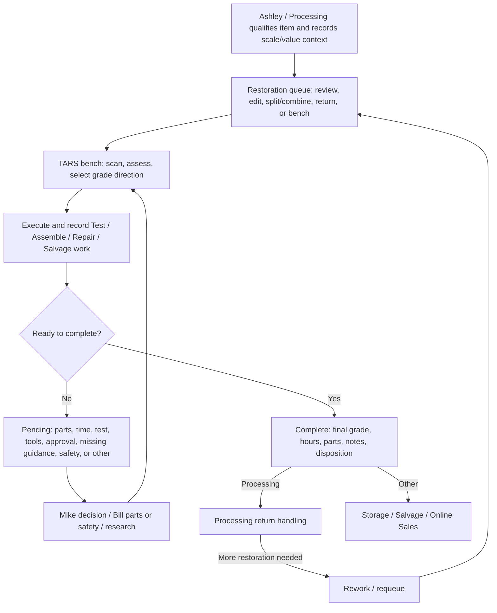

<!-- Last updated: 2026-07-10 (Phase 1 MVP accepted; live use feeds continuous improvement) -->

# TARS Phase 0 — Process Canon and Product Direction

**Status:** **Approved 2026-07-10** by Bill + Mike joint operating direction. Phase 1 MVP accepted; Ashley/Mike live feedback enters continuous improvement.

**Initiative:** [`tars_full_instruction_wizard_guidance`](../../initiatives/tars_full_instruction_wizard_guidance.md)

**Discovery evidence:** [`phase_0_discovery_workbook.md`](./phase_0_discovery_workbook.md)

---

## Approval

| Approver | Name | Decision | Date | Notes / approved exceptions |
|----------|------|----------|------|-----------------------------|
| Owner | **Bill Rollins** | **Approved** | 2026-07-10 | Owner/CEO, superuser, product builder, parts orderer |
| Restoration lead | **Mike** | **Approved via joint operating direction represented by Bill** | 2026-07-10 | Lead Restoration and current Restoration performer |
| Processing lead | **Ashley** | Live-use accuracy/usability feedback | Continuous improvement | Original pre-acceptance checkpoint retired by Bill |
| Other Processing staff | Ashley's team | Live-use usability/accuracy feedback | Continuous improvement | Future operational participants |

This canon is the approved product/operating direction. Transactional gaps remain implementation work, and Ashley's live-use feedback may refine Processing-facing detail without reopening the core direction.

**Phase 1 implementation update:** The linked Processing handoff and Restoration Guided decision MVP now encode this sequence in the live app with schema/catalog versioning, server-authoritative economics, ordinary override identity, and non-economic mandatory stop-outs. The MVP passed automated representative coverage and Bill accepted it on 2026-07-10. Ashley/Mike live use now feeds continuous improvement rather than blocking functionality; evidence is tracked in [`phase_1_pilot_record.md`](./phase_1_pilot_record.md).

---

## Canon purpose

This canon defines:

- where TARS work begins and ends;
- the responsibilities and handoffs among Processing, Restoration, Lead/Manager, and Owner;
- the decisions, records, holds, mandatory stop-outs, truthful classifications, and exits required for reliable work;
- the boundary between operational policy, reusable guardrails/templates, coaching, and transactional product behavior;
- the approved starting point for Phase 1 guidance.

It does not replace `RestorationJob` as the transactional source of truth and does not make the reference prototype the current product contract.

---

## Product direction — fixed guardrails

1. **Brownfield:** Extend the live Queue, TARS workstation, Parts Requests, and Restoration Returns flows.
2. **One transaction lifecycle:** Guidance must not create a second job state, timer, parts record, grade result, or disposition.
3. **Structured work, not formal documents:** The product is an in-dashboard worksheet/template and saved decision system, not primarily an SOP library.
4. **Comparable decisions:** Reusable tests, scales, rules, steps, evaluation/salvage methods, and saved reasons should help different people reach similar decisions from similar evidence.
5. **Human authority:** Bill owns product/business guardrails; Bill + Mike approve TARS policy and mandatory legal/handling/disclosure stop-outs.
6. **Narrow MVP:** Phase 1 proves one end-to-end journey before broad coverage or a full authoring system.
7. **Transactional gaps stay classified:** Guidance may expose a bench defect; it does not silently absorb the fix.
8. **Low-margin reality:** Optimize valid paths primarily by expected contribution margin per labor minute and workload pressure, not by maximizing restoration quality.
9. **Explicit sale state:** Untested, partially tested, broken, expired, no-warranty/as-is, and salvage may be legitimate classifications when allowed and represented truthfully; prohibited categories and mandatory handling/disclosure rules remain hard stop-outs.

**Initial ownership:** Bill builds and maintains the guardrail structure, orders parts, and approves consequential product/policy changes. Mike owns Restoration execution and day-to-day feedback. Ashley owns Processing handoff practice. Bill + Mike jointly approve the TARS canon.

The exact Phase 1 worksheet shape, reusable-versus-item fields, calculations, interaction model, and later editing architecture remain deferred to their phase plans.

---

## Current floor grounding

- **Mike is new to Eco-Thrift** and is the current/only Restoration performer.
- The TARS web app is being used as the formal Restoration system for the first time; prior work was informal.
- There is no mature legacy worksheet or app record pattern to preserve. This is the opportunity to establish the common structure.
- **Ashley already provides generally complete and consistent scale/per-grade values.** Phase 1 should preserve that behavior and add only upstream evidence/context that changes or explains Mike's evaluation.
- Primary current pain is **assessment, grade direction, and deciding the next TARS action**.
- Ashley's direct feedback is collected during normal use through continuous improvement; it is not a pre-functionality gate.

### Universal evaluation sequence — approved direction

1. **Identity and context** — verify the item, Ashley's handoff, grade scale, and values.
2. **Mandatory stop-out screen** — identify prohibited categories or handling/disclosure conditions that must block or constrain the path; do not turn this into exhaustive quality testing.
3. **Completeness and condition** — capture missing parts, damage, contamination, wear, and observable state.
4. **Tests and results** — run the relevant reusable tests; save result, evidence, uncertainty, and what the result rules in/out.
5. **Viable grades/outcomes** — identify realistic grade directions supported by evidence.
6. **Value, time, and parts** — compare the effort/resources and likely result for viable paths.
7. **Action and reason** — choose Test / Assemble / Repair / Salvage / approved alternative; save the reasoning and any exception.

The worksheet's first priority is steps 3–4: **tests performed, results, condition evidence, and unknowns**. Economics and completion controls follow the evidence rather than replace it.

### Universal decision principles — approved direction

1. **Test only when the result can change the decision.** Do not spend labor proving facts that will not alter grade, sale state, action, or disposition.
2. **Use the cheapest/fastest uncertainty-reducing step first.** Prefer high-information, low-time tests before parts, disassembly, or long repair attempts.
3. **Compare all viable outcomes.** Working/graded sale, partially tested, untested/as-is, broken/as-is, repair, assemble, and salvage are valid candidates when allowed.
4. **Primary score:** expected contribution margin per labor minute, adjusted for queue/backlog pressure.
5. **Delay irreversible work until justified.** Disassembly/salvage should follow enough evidence to show it beats the best intact/as-is path or that no valid intact path remains.
6. **Preserve truthful classification.** Tested status, known defects, missing parts, and uncertainty must be saved so downstream labeling/disclosure can match reality.
7. **Record exceptions.** If Mike chooses a lower-ranked path, save the reason; Bill and Mike review exceptions weekly to improve the reusable rules.
8. **Mandatory stop-outs remain.** Legal/prohibited-sale, handling, and required-disclosure constraints cannot be overridden by margin.

---

## Canonical lifecycle

### As-is product flow — code-derived

**Approved human flow:** queued → bench directly. The model/API `sent` state is obsolete in the intended human process and should be classified as transactional cleanup, not taught to Mike or Ashley.

### As-intended process spine — approved

| Step | Goal | Primary owner | Required input | Required outcome / record | Escalation |
|------|------|---------------|----------------|---------------------------|------------|
| **1. Qualify and hand off** | Send appropriate work with enough comparable context for Restoration to start correctly. | Ashley / Processing | Eligible item, identity, grade scale, positive grade values, required handoff fields | Restoration job and physical handoff are aligned. | Ashley + Mike resolve route/value uncertainty. |
| **2. Receive and prepare** | Confirm the right item is at the right bench and apply the minimum mandatory stop-out screen. | Mike | Queue job and physical item | Direct bench check-in, identity/context confirmed, tested status starts explicit. | Return mismatch/misroute to Processing; stop prohibited/handling-blocked work. |
| **3. Assess** | Collect only evidence that can change a plausible outcome. | Mike | Item, Ashley's grade/value context, reusable test/evaluation template | Saved tests/findings/unknowns and viable grade/sale states. | Mike researches ordinary uncertainty; Bill + Mike resolve mandatory stop-outs. |
| **4. Plan** | Apply reusable rules/ways of thinking to choose the next TARS action and required time/parts/tools. | Mike | Saved assessment and target grade | Saved action/decision, reason, expected outcome, and parts/tool need. | Mike escalates consequential spend/policy to Bill. |
| **5. Execute and record** | Perform only economically justified work and preserve evidence, actions, and changed decisions. | Mike | Valid selected path | Work Bench rows, timer/work details, decision changes and reasons. | Hold when informed progress cannot continue or the next step no longer clears the economic rule. |
| **6. Pause and resolve** | Keep blocked items controlled and route the blocker to an accountable resolver. | Mike initiates | Hold reason, storage location, actionable notes | Pending job with clear next action and resume trigger. | Mike resolves ordinary research/approval; Bill orders parts; Mike + Bill clear mandatory stop-outs. |
| **7. Complete and dispatch** | Close work with a defensible result and physical/system destination. | Mike | Final condition, work/cost facts, applied decision rules | Final grade, hours, parts, reasons/notes, disposition, physical handoff. | Mike + Bill resolve consequential exceptions; Ashley owns Processing return handling. |
| **8. Return or rework** | Handle downstream rejection, misroute, or new work without losing accountability. | Ashley or Mike by entry point | Returned/rejected item and required reason | Processing handled record, or cleanly requeued Restoration job with history. | Ashley + Mike resolve ownership; any completed/returned re-entry counts as rework. |
| **9. Learn and improve** | Turn recurring ambiguity or inconsistent outcomes into a better reusable rule/template or product change. | Bill with Mike/Ashley evidence | Saved item decisions, exceptions, and feedback | Tracked guardrail/product decision and communication. | Bill owns product structure; joint Bill + Mike approval for TARS policy. |

Ashley validation of Processing-facing details occurs through post-acceptance continuous improvement; all rows remain the approved Phase 0 direction unless explicitly versioned.

---

## Vocabulary — approved

| Term | Canonical meaning | Avoid / clarify |
|------|-------------------|-----------------|
| **TARS** | Test, Assemble, Repair, Salvage: the restoration work system and action vocabulary. | Do not use only as a page name when referring to the broader process. |
| **Restoration job** | The transactional record linked to an item check-in and its Restoration lifecycle. | Not a guidance session or SOP record. |
| **Queue** | Work accepted for Restoration but not actively on Mike's bench. | The human flow does not use a separate `sent` state. |
| **Bench** | Work actively checked into the TARS workstation. | Physical bench and model stage should stay aligned. |
| **Grade scale** | The approved set of possible condition/outcome grades for an item. | Not the same as the selected/final grade. |
| **Grade value** | Processing-provided retail value for an item at a possible grade. | Not acquisition cost or guaranteed sale price. |
| **Grade direction** | The target grade currently being evaluated or pursued. | Not final grade until completion. |
| **Work Bench row** | A recorded Test/Assemble/Repair/Salvage action in the unified work log. | Do not describe removed verb sub-tabs as current behavior. |
| **Pending / hold** | Work intentionally paused with a controlled reason, location, notes, and resume condition. | Not an unowned backlog state. |
| **Missing guidance / research** | A hold because a safe/consistent decision needs missing evidence, a reusable rule, or research. | Not a request to create a formal SOP document by default. |
| **Safety hold** | A stop because proceeding may be unsafe. | Never a low-priority generic note. |
| **Disposition** | The system and physical destination after completion. | Distinguish from a work action or grade. |
| **Return** | Work sent back to Processing or otherwise routed for downstream handling/rework. | Define untouched return versus completed-to-Processing. |
| **Rework** | Any completed or returned item that re-enters Restoration. | Preserve prior history and capture the re-entry reason. |
| **Process canon** | The approved definition of how TARS work should operate. | Not identical to UI copy or implementation detail. |
| **Guardrail** | A reusable test, field, calculation, rule of thumb, decision rule, warning, step, or constraint that structures work. | Not generic help copy or a separate document by default. |
| **Worksheet/template** | The in-dashboard structure Ashley or Mike completes for a specific handoff/evaluation/work decision. | Applied item data must remain distinct from the reusable template version. |
| **Decision record** | Saved evidence, applied rule/template version, selected outcome/action, reason, and later result. | Not only a free-text note. |

---

## Role and authority matrix — approved

| Responsibility | Ashley / Processing | Mike / Restoration | Bill / Owner-builder | Joint / notes |
|----------------|---------------------|--------------------|----------------------|---------------|
| Decide initial Restoration route | Responsible; Ashley owns team practice | Consulted on exceptions | Sets business guardrails | Ashley + Mike resolve edge cases |
| Set initial scale and grade values | Responsible for initial values | Reviews and resolves corrections with Ashley | Controls scale-definition capability/policy | Manager+/Bill creates reusable scales |
| Receive/check into bench | Informed | Responsible | — | Direct queued → bench |
| Assess and choose grade direction | Corrects upstream context when needed | Responsible using saved worksheet/guardrails | Designs reusable structure; reviews consequential exceptions | Similar evidence should produce similar decisions |
| Execute and log work | — | Responsible | Designs required decision/work structure | Mike supplies operational feedback |
| Initiate hold | — | Responsible | — | Hold must preserve reason, location, next action |
| Resolve ordinary approval/research | Consulted when handoff context is involved | Responsible | Consulted for consequential policy/spend | Missing guardrail becomes improvement evidence |
| Resolve safety hold | Informed if item returns | Joint operational clearance | Joint policy clearance | Mike + Bill |
| Submit parts need | — | Responsible | Reviews/approves | Mike identifies the item/grade need |
| Order parts | — | Consulted | Responsible | Bill orders; receipt/resume handoff still to validate |
| Confirm parts receipt / resume | — | Responsible | Informed | Mike confirms physical receipt at Restoration and resumes the job |
| Complete and choose disposition | Owns Processing return after handoff | Responsible within policy | Reviews consequential exception | Saved reason required for exception |
| Handle Processing return | Responsible | Consulted | — | Ashley + Mike resolve disputes |
| Change TARS process policy | Consulted | Joint approver / proposer | Joint approver / product owner | Bill + Mike jointly |
| Change guardrail/template structure | Provides feedback | Provides feedback | Responsible initially | Later delegation is Phase 2 |
| Triage improvement feedback | Owns Processing evidence | Owns Restoration evidence | Prioritizes/builds product changes | Recurring review cadence pending |

The current model deliberately names the actual people. Future roles should inherit this authority intentionally, not assume broad staff access equals policy authority.

---

## Instruction authority matrix — approved

| Class | Meaning | App behavior default | Approval |
|-------|---------|----------------------|----------|
| **Policy** | Required operating rule established by accountable leadership. | Clear instruction; acknowledgement/gate only when justified. | Owner + Lead for TARS canon |
| **Mandatory stop-out** | Law, prohibited category, handling constraint, or required truthful disclosure blocks/constrains the path. | Prominent stop/classify/escalate behavior; no economic override. | Bill + Mike; obtain specialist/legal input when needed |
| **Hard gate** | Transaction cannot proceed until valid data/action exists. | Server-enforced where transactional; explicit recovery path. | Policy owner + product validation |
| **Warning** | Proceeding may be wrong, costly, or risky but an authorized exception exists. | Explain consequence and escalation/override path. | Process owner |
| **Recommendation** | Preferred method that supports quality or efficiency. | Actionable guidance; experienced fast path may remain. | Process/content owner |
| **Optional technique** | Example or helpful method without authority. | Clearly labeled; never presented as policy. | Content owner |

### Existing hard gates to validate as policy

- Positive values for every grade before send/bench check-in.
- Eligible item/location/condition for queue scan.
- Single-item bench work after split.
- Valid pending reason and completion disposition.
- Final grade must belong to the selected scale.
- Selected grade before creating/submitting a grade-linked parts request.

### Existing soft behavior to classify

- Low/high time warnings at completion.
- Idle bench/timer warnings.
- Grade/value mismatch and combine confirmations.
- `needs_approval`, `research_sop`, and `safety_hold` with no routed resolver.

---

## Gap register

| ID | Gap | Classification | Phase / destination | Owner | Status |
|----|-----|----------------|---------------------|-------|--------|
| **G01** | `sent` remains in code although the human flow is queued → bench. | Transactional cleanup | Parked workspace or dedicated fix; do not teach it | Bill | **Policy resolved** |
| **G02** | Dashboard verb counts read legacy `actions`, while live UI writes `benchRows`. | Data/transactional | Dedicated fix later; do not use as MVP KPI | Bill | Confirmed gap |
| **G03** | Parts-received signal may not reliably survive client session merge. | Transactional | Validate during Phase 1 parts use; parked workspace if confirmed | Bill + Mike | Open validation |
| **G04** | Parts APIs do not encode Mike-submit/Bill-order authority. | Permissions + transactional | Policy resolved; transactional alignment later | Bill | Open implementation gap |
| **G05** | Ordinary research/approval and safety clearance have owners but no routed guardrail/workflow. | Guardrail + possible product | Phase 1 candidate or transactional dependency | Bill + Mike | Open implementation gap |
| **G06** | Bench needs a clean return-to-Processing-with-reason path for misroutes. | Process + transactional | Policy resolved; parked workspace if action missing | Mike + Ashley | Open implementation gap |
| **G07** | Staff-wide scale creation does not match Manager+/Bill scale-definition authority. | Policy + permissions | Policy resolved; transactional alignment later | Bill | Open implementation gap |
| **G08** | Requeue resets lifecycle although approved rework needs prior history/reason. | Transactional | Parked workspace / event-history design | Bill + Mike | Confirmed gap |
| **G09** | Rework definition is approved but not reliably instrumented. | Measurement | Any completed/returned item re-entering Restoration; Phase 3 metric | Bill + Mike | Definition resolved |
| **G10** | “Awaiting parts” currently represents all pending work. | Data/transactional | Metric fix outside Phase 0; parts-only is approved meaning | Bill | Confirmed gap |
| **G11** | No durable missing-guardrail/inconsistent-decision feedback intake exists. | Process + guardrail | Weekly Bill decision log temporarily; permanent Phase 3 | Bill | Temporary route resolved |
| **G12** | Guardrail review cadence and ownership needed definition. | Governance | Bill + Mike weekly; Ashley joins relevant handoff/return items | Bill + Mike | Resolved |
| **G13** | The first structure must serve Mike and Ashley; future Restoration role layering remains untested. | Product guardrail | Phase 1 now; future expansion later | Bill + Mike | Direction resolved |
| **G14** | Reusable guardrails/templates have no activate/version/snapshot/rollback system. | Structured product | Phase 2 | Bill | Deferred |

---

## Minimal measurement baseline

Phase 0 will record:

1. active work by stage;
2. completed work by day/week;
3. completion disposition mix;
4. Processing-return backlog and age;
5. pending reason mix and age;
6. bench cycle time;
7. parts-request wait;
8. validated rework indicators;
9. recent `benchRows` versus `actions` data health;
10. optional time-data completeness (`spent_hours` versus timer seconds).

### Production snapshot — 2026-07-10T14:41:25-05:00

Read-only ORM queries used the configured `production` alias inside a read-only transaction. Window: prior 28 days.

| Measure | Snapshot | Interpretation / limitation |
|---------|----------|-----------------------------|
| Total jobs | 4: 2 done, 2 returned, 0 active; 0 multi-quantity jobs | TARS is at an extremely small baseline; rates and targets would be misleading. Legacy stack handling is not a current production constraint. |
| Completed in window | 2, both dispositioned to Processing | No useful disposition comparison yet. |
| Bench elapsed time | Median 82.16h; range represented by 22.82h and 141.49h | Wall-clock elapsed time, only two jobs, and not a labor-duration KPI. |
| Completion data | 2/2 spent-hours; 2/2 parts-cost; 1/2 timer-seconds; 1.03 total spent hours | Timer use is incomplete; do not compare people or productivity. |
| Current pending | 0 | No pending-reason/age baseline yet. |
| Processing returns pending | 0 | No return-age baseline yet. |
| Parts requests | 1 draft; 0 submitted/ordered open | Parts workflow is not yet exercised enough to measure. |
| Work-session shape | 4 recent jobs: 2 with `benchRows`, 0 with legacy `actions`, 2 with neither | Confirms current verb dashboard metrics cannot represent live Work Bench rows. |
| Rework | Not countable from current lifecycle reset | Approved definition needs future event/history instrumentation. |

**Phase 1 baseline conclusion:** measure **structured evidence/test completion, saved decision/reason completeness, and Ashley→Mike handoff usability** during the pilot. Do not use throughput, verb counts, cycle time, or rework rate as success targets at this volume.

---

## Phase 1 MVP handoff — selected

### Primary users

- **Mike:** primary Restoration worksheet user and decision maker.
- **Ashley:** upstream Processing handoff user whose structured context feeds Mike's evaluation.
- **Bill:** guardrail/template builder, policy owner, exception/parts decision maker.

### Selected journey

**Selected:** Ashley creates a structured Restoration handoff → Mike receives the item → follows a reusable assessment/test worksheet → selects and saves grade direction + next TARS action with reasons.

This targets the highest reported pain: **assessment, grade direction, and deciding the next TARS action**. The first worksheet priority is **tests performed, results, condition evidence, and unknowns**.

### Product-level integration point

Linked structures in the existing Processing handoff and TARS bench. It must save item-level evidence/decisions against the live job and must not create a competing transaction surface.

### Phase 1 finish line

Ashley can hand off one item with complete comparable context; Mike can use a reusable evaluation/test structure to save evidence, select grade direction and next TARS action, and record the reason; Bill can inspect the resulting decision and identify how to improve the reusable guardrail.

### Acceptance

- [ ] Ashley completes the handoff and Mike completes the linked assessment/decision without an off-app worksheet.
- [ ] Bill + Mike confirm the guardrails match the approved canon.
- [ ] Similar evidence is represented in comparable fields and exceptions require a saved reason.
- [ ] Existing transactions, permissions, and failure paths remain intact.
- [ ] Tested/untested/broken/as-is classification, mandatory stop-outs, escalation, support, and rollback checks pass.
- [ ] Pilot produces enough evidence to recommend expand, revise, or stop.

### Pilot learning questions

1. Does the structure capture enough evidence for Mike to make and later explain the grade/action decision?
2. Does Ashley's handoff reduce missing or non-comparable context at the bench?
3. Which reusable tests/rules help consistency, and which fields add burden without changing a decision?

### Operating cadence

Bill and Mike review guardrail gaps, unsupported cases, and inconsistent decisions **weekly** during the initial rollout. Ashley joins when the issue concerns Processing handoff, grade/value context, or returns.

Until an in-app improvement object exists, Mike and Ashley flag missing guardrails/inconsistent decisions to Bill; Bill records them in the weekly TARS decision log. This feedback improves the accepted MVP and does not block current functionality.

### Explicitly out of scope

- Full TARS rule/template coverage.
- Final editor/versioning architecture.
- Generic LMS/training platform.
- Automatic hard gates without approved policy and recovery paths.
- Transactional bench fixes not explicitly assigned.

---

## Evidence and technical anchors

- Discovery workbook: [`phase_0_discovery_workbook.md`](./phase_0_discovery_workbook.md)
- Early product prototype: [`TARS.dc.html`](./TARS.dc.html)
- Parked transactional initiative: [`tars_restoration_workspace`](../../initiatives/_archived/_pending/tars_restoration_workspace.md)
- Queue/bench services: [`restoration.py`](../../../apps/inventory/services/restoration.py), [`restoration_bench.py`](../../../apps/inventory/services/restoration_bench.py)
- Live workstation: [`TarsWorkstation.tsx`](../../../frontend/src/pages/restoration/tars/TarsWorkstation.tsx)
- Unified work log: [`TarsWorkBenchTable.tsx`](../../../frontend/src/pages/restoration/tars/TarsWorkBenchTable.tsx)
- Holds: [`TarsHoldDialog.tsx`](../../../frontend/src/pages/restoration/tars/TarsHoldDialog.tsx)
- Completion: [`TarsDoneDialog.tsx`](../../../frontend/src/pages/restoration/tars/TarsDoneDialog.tsx)
- Parts requests: [`TarsPartsRequestsPage.tsx`](../../../frontend/src/pages/restoration/TarsPartsRequestsPage.tsx)
- Processing Restorations hub: [`RestorationsPage.tsx`](../../../frontend/src/pages/inventory/restorations/RestorationsPage.tsx)
- Metrics: [`dashboard_metrics.py`](../../../apps/pos/services/dashboard_metrics.py)
- Behavioral tests: [`test_restoration_queue.py`](../../../apps/inventory/tests/test_restoration_queue.py)
