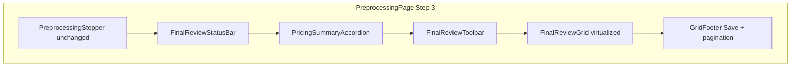

# Final Review page — implementation plan (amended 2026-05-02)

**Visual pass (mockup ground truth):** Execution priority is **[`final_review_visual_rebuild_directive.md`](final_review_visual_rebuild_directive.md)**. Where this file conflicts on **layout/visuals** (status bar vs stepper Finalize, stat cards vs accordion, toolbar Save vs footer, table column set, no virtualization this pass), **the directive wins**. The sections below remain the longer-term spec (issue chips, virtualized grid, selection-based bulk, `useBlocker`, etc.) for a **follow-on pass** after the visual directive is shipped.

---

## Scope

- **In scope:** Step 3 **Final Review panel** on [`PreprocessingPage.tsx`](frontend/src/pages/inventory/PreprocessingPage.tsx) and refactor of [`PreprocessingReviewTable.tsx`](frontend/src/components/inventory/PreprocessingReviewTable.tsx) (likely split under `frontend/src/components/inventory/preprocessing/finalReview/`).
- **Out of scope:** Django/DRF contract, `PreprocessingRow` / serializers, Step 1–2.
- **Page chrome unchanged:** stepper, order picker dropdown, Back to Order, cream background `#F4F1EB`, page header layout. Only the Step 3 panel is rebuilt.

---

## Terminology: issues vs blockers

- **`deriveFinalReviewIssues(rows, draftsById)`** (rename; never `deriveFinalReviewBlockers`) returns `{ missingPriceCount, aiFlaggedCount, unsavedCount }`.
- **Blockers (Finalize):** `missingPriceCount > 0 || unsavedCount > 0` disables Finalize. **AI flagged does not block Finalize.**
- **Status bar chips** are **issue / attention chips**, not “blocker chips.”
- **Finalize tooltip:** `Cannot finalize: N missing price, M unsaved edits.` (no AI mention.) Per **[consult_design_final_review.md](.ai/reference/consult_design_final_review.md)** §9.2.

---

## Architecture (target layout)

Parent owns: `reviewRowsFull`, `getPreprocessingReview(full:true)`, `mergeReviewPatches`, `orderId`, `finalizePreprocessingMutation`. **`deriveFinalReviewIssues`** is the single source for headline, issue chip counts (when non-zero), Finalize gating, and filter toggles.

---

## 1. Contradiction and single source of truth

**Root cause:** Green alert (`completedStep >= 2`) vs `missing_price` from different backend rules ([`preprocessing_status`](apps/inventory/views.py) `final_rows` vs effective price).

**Work:**

- Implement **`deriveFinalReviewIssues`** in e.g. `finalReviewIssues.ts`.
- `missingPriceCount`: same rule as [`summarizePreprocessingReviewRows`](frontend/src/components/inventory/preprocessing/reviewSummary.ts) (effective `final_price` or `proposed_price`).
- `aiFlaggedCount`: meaningful `ai_status` (mirror [`PreprocessingAiStatusBar`](frontend/src/components/inventory/PreprocessingReviewTable.tsx)).
- `unsavedCount`: row ids with non-empty draft patches.
- Replace misleading **`Alert`** with logic driven by `deriveFinalReviewIssues` + status bar headline. Do not use `completedStep >= 2` alone for “all priced” messaging.

---

## 2. Status bar + Finalize placement

- **`FinalReviewStatusBar`:** `Card outlined`, three regions; issue chips center; Finalize right; tooltip lists **blockers only** (§9.2).
- Move Finalize from [`PreprocessingStepper`](frontend/src/pages/inventory/PreprocessingPage.tsx) action slot for step 2; avoid duplicate Finalize.
- **Issue chip ↔ filter toggle:** second click turns filter **off**; toolbar chips share the same boolean; identical selected styling (design §4.3, §6.1).

---

## 3. Pricing summary

- **`PricingSummaryAccordion`:** totals from **full** `reviewRowsFull` via `summarizePreprocessingReviewRows`.
- **Expanded only:** when any filter/search active, `caption`: `Totals reflect all N rows in this PO, not the current filter.` (real **N**). Suppress when no filter.

---

## 4. Toolbar: filters, search, bulk actions

**Filters:** `filterMissingPrice`, `filterAiFlagged`, `filterUnsaved`, `filterNoCategory` — AND. **`applyFilters` + debounced search** (300ms).

**Search haystack (approved):** title, brand, description, model, vendor SKU, UPC, ASIN, **all flattened `identifiers` values**. Precompute per-row search string at load; placeholder: **Search title, brand, description, identifiers.**

**Bulk actions — Option A (default):**

- Disabled until `selected.size > 0`.
- **SelectAllVisible:** ids on **current pagination page** of the filtered+sorted list — **not** virtual viewport, **not** full filtered set.
- Confirm modal when `selected.length > 10` for ±10%, set ideal, reset to AI.
- **Option B (fallback if Bill objects in QA):** no selection ⇒ implicit “current page” + confirmation; document in CHANGELOG if enabled.

Remove Save from toolbar.

---

## 5. Grid, expand panel, footer

- Columns per design §7.1 (no default Description; no Base/Ideal/Vs Ideal in default row unless moved to expand).
- **Status column — explicit priority** (mutually exclusive):

  1. Unsaved: pencil, `info.main`, "Unsaved changes."
  2. Missing price: `MoneyOff`, `error.main`, "No price set."
  3. AI flagged: Warning, `warning.main`, tooltip = `ai_status` reason.
  4. Clean: empty (no checkmark).

- **Expand panel:** sections **exactly** as design §7.7 (Section 1 layered strip through Section 5 raw row); lazy mount; dividers; `action.hover`; "not set" for empty.
- **Footer:** one row, full width, **sticky** bottom of grid container, **~48px**, `grey.50` / `action.hover`; **Left** row counts + filtered context; **Center** rows/page (25, 50, 100, 200), prev/next, page input, **Jump to row**; **Right** Save Changes.

---

## 6. Inline edit and persistence

- Display → edit on focus; **Enter** commit draft; **Escape** revert/blur; **Tab** navigates editable cells.
- **Delete** price `onBlur` auto-save and **delete** 30s timer entirely.
- **Only** `PATCH` via footer Save. Snackbars: `Saved N rows.` / `Save failed: {message}.`
- **Save button — exact copy** (design §8.2 table): labels, tooltips, disabled rules, saving state, post-failure tooltip.

---

## 7. Loading / empty / error

- **Skeletons (§10.1):** headline 240px; **3** chips × 80px; pricing collapsed **3** × 80px; toolbar disabled; grid **10** rows × 40–44px; **headers from static config, not skeleton.**
- No full-page centered spinner for review load.

---

## 8. Virtualization (definitive)

- Use **`@tanstack/react-virtual`** + `useVirtualizer`. Add dependency if absent.
- Container: **`flex: 1; minHeight: 0`** fills viewport under Final Review stack.
- **Remove** MUI X DataGrid as alternative for this grid.
- **Fallback milestone:** if fragile, ship layout + sort + footer first; add virtualizer last (design §16 order).

---

## 9. Keyboard shortcuts + navigation

- **First pass:** `/`, `Tab`, `Shift+Tab`, `Enter`, `Escape`, `Ctrl+S`, `Ctrl+Enter` (Finalize when enabled). **`?` cheat sheet lists first pass only.**
- **Defer:** `j`, `k`, `e`, `x`.
- **`useBlocker`** when `unsavedCount > 0`: Save / Discard / Cancel. Optional `beforeunload` secondary.

---

## 10. Finalize confirmation modal

Exact copy in design **§9.3** (title with `orderNumber`, body bullets, Cancel text / Finalize primary).

---

## 11. Row memoization (contract)

- Memoized row: stable **`row`** + **callbacks object** from parent (`useCallback`).
- Selection, expansion, drafts: **refs** inside row where needed ([`AuctionListDesktop.tsx`](frontend/src/pages/buying/AuctionListDesktop.tsx) pattern).
- **Profiler:** editing one cell must not rerender other rows.

---

## 12. Category Autocomplete — hard requirement

- Options: **`TAXONOMY_V1_CATEGORY_NAMES`** from [`taxonomyV1.ts`](frontend/src/constants/taxonomyV1.ts).
- **Before merge:** verify parity with backend `PATCH preprocessing-review` category validation; fix drift if any.
- **Comment** in component citing backend validation source.

---

## 13. QA (design §17 + additions)

- Done definition in design §17.
- **Plus:** (1) After save clears drafts, unsaved icons clear in one cycle. (2) Filter to 12 rows, select all visible, -10% only touches those IDs in `reviewRowsFull`. (3) Navigate away: Discard exits; Save persists then exits; Cancel keeps edits.

---

## 14. CHANGELOG

Stub already under **`[Unreleased]`** in [`CHANGELOG.md`](CHANGELOG.md) (**Preprocessing Final Review UI rebuild — planned**). Update with final bullets when implementation merges.

---

## 15. Documentation

- Post-ship: [`preprocessing_page_review.md`](.ai/reference/preprocessing_page_review.md) Final Review section.
- Design authority: [`consult_design_final_review.md`](.ai/reference/consult_design_final_review.md).
