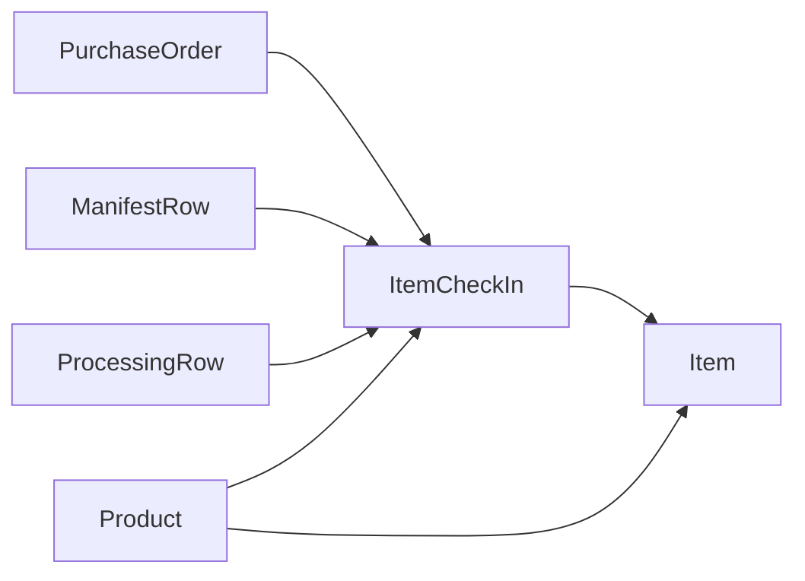

# Item Check-In Normalization — Completed

**Status:** Hard cleanup shipped (**`0063`** + **`0064`**)  
**Date:** 2026-06-15  
**Initiative:** [`product_item_crud_and_processing`](../../initiatives/product_item_crud_and_processing.md)

## Problem (historical)

Check-in membership originally lived only in `ProcessingCheckInBatch.item_ids` JSON. Items had no direct FK to their check-in event; readers scanned JSON arrays; staging `ProcessingRow` purge risked orphaning batch semantics.

## Target model (current)

| Concept | Implementation |
|---------|----------------|
| Check-in event | **`ItemCheckIn`** (renamed from `ProcessingCheckInBatch` in **`0063`**) |
| Item membership | **`Item.check_in`** → `ItemCheckIn` (`SET_NULL` on check-in delete) |
| Staging lineage | **`ItemCheckIn.processing_row`** nullable, `SET_NULL` when staging purged |
| Durable lineage | **`ItemCheckIn.manifest_row`** nullable, `SET_NULL` |
| Origin | **`ItemCheckIn.origin`**: `processing` \| `product_ad_hoc` \| `manual` |
| Event count | **`ItemCheckIn.quantity`** denormalized count (may become derived later) |



## Migrations

| Migration | Change |
|-----------|--------|
| **`0063`** | Rename model → `ItemCheckIn`; add `Item.check_in` FK; backfill FK from legacy JSON |
| **`0064`** | Drop **`ItemCheckIn.item_ids`** column |
| **`0065`** | Remove duplicate **`Item.check_in`** index; rename **`ItemCheckIn`** indexes after model rename |

Historic migration files still mention `ProcessingCheckInBatch` / `item_ids` — that is expected schema history.

## Backend API (canonical)

| Surface | Name |
|---------|------|
| Item serializer field | **`item_check_in_id`** (`source='check_in_id'`) |
| Check-in create responses | **`item_check_in_id`**, **`item_check_in_ids`** (collapse groups) |
| Item list filter | **`?item_check_in=`** |
| Remap / delete / update | **`POST …/item-check-ins/{item_check_in_id}/remap-product\|delete\|update`** |
| Workspace payload | **`itemCheckIns`** with nested **`items`** (no separate `item_ids`) |

Helpers in **`apps/inventory/processing_ops.py`**: **`remap_item_check_in_product`**, **`delete_item_check_in`**, **`update_item_check_in`**, **`_items_for_item_check_in`** (FK-only).

## Frontend (canonical)

| Surface | Name |
|---------|------|
| DTO | **`ItemCheckInDTO`** |
| Item field | **`item_check_in_id`** |
| Workspace row | **`itemCheckIns`** |
| Rich search | **`{checkin=…}`** → API **`item_check_in`** (no `batch` alias) |
| UI copy | **Check-in #…** (not “batch”) |

## Out of scope (unchanged)

- **`ProcessingRow.item_ids`** workspace denorm — separate cleanup
- V1/V2 import commands, `uses_legacy_processing`, **`BatchGroup`** legacy pages

## Verification

```sql
-- Items missing check-in FK when they should have one (should be 0 for post-0063 data)
SELECT id, sku FROM inventory_item
WHERE check_in_id IS NULL AND status NOT IN ('intake', 'processing');

-- Check-ins orphaned from staging (expected after row purge)
SELECT id, processing_row_id, manifest_row_id, quantity
FROM inventory_itemcheckin
WHERE processing_row_id IS NULL;
```

## Tests

- **`apps/inventory/tests/test_product_check_in.py`** — product check-in + FK filters
- **`apps/inventory/tests/test_processing_split.py`** — remap / update / delete item check-ins
- **`apps/inventory/tests/test_processing_collapse_groups.py`** — `item_check_in_ids`
- **`apps/inventory/tests/test_processing_validation_matrix.py`** — workspace `itemCheckIns`
- Frontend: **`checkedInHistory*.test.ts`**, **`richInventorySearch.test.ts`**

## See also

- Models: [`apps/inventory/models.py`](../../../apps/inventory/models.py)
- Migrations: [`0063`](../../../apps/inventory/migrations/0063_item_check_in_normalization.py), [`0064`](../../../apps/inventory/migrations/0064_remove_itemcheckin_item_ids.py)
