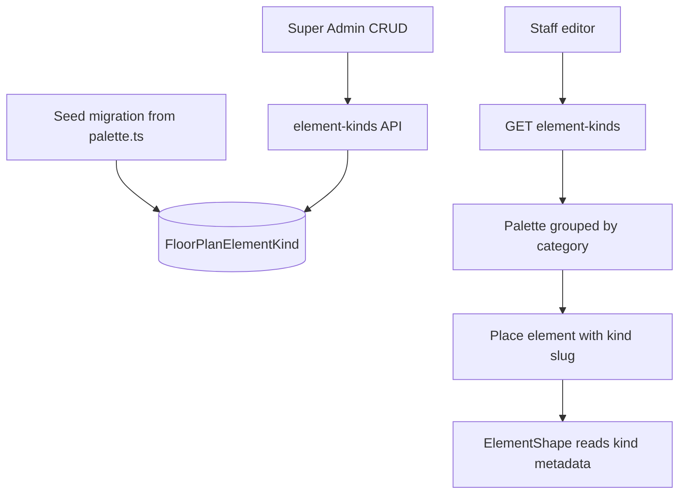

# Floorplan — DB element kinds & shape control

**Status:** **Implemented** 2026-07-02 — released **v2.40.0** (initiative `.ai/initiatives/_archived/_completed/floorplan_builder.md` Session 1)  
**Last updated:** 2026-07-02

**Decisions taken (per §Open decisions):** A global catalog · B in-editor management only · C system kinds editable-not-deletable, slug immutable for **all** kinds · D auto slug from label + uniqueness suffix (explicit slug optional on create) · E free-text category with autocomplete of existing · F `rect` + `corner_radius` + separate `circle` (circle normalizes radius to 0; ovals allowed) · G kind-level fill/image only · H legacy "Custom" asset palette section **removed** · I no schema bump · J legend reads the kinds map, swatch from `fill_color`.

## Goals

1. **Create New Element** — Super Admin defines reusable element types: name, category, default size (W×H), optional default SVG/image, or fill color when no image.
2. **Shape control** — Sharp corners by default; optional corner radius on rectangles; optional circle/ellipse footprint.
3. **Configurable catalog** — Move element definitions out of hardcoded frontend code into the database. Only **Super Admin** (`is_superuser` / `IsSuperAdmin`) may create or edit kinds; staff use them when editing floorplans.

## Current state (v2.39.0)

| Area | Today |
|------|--------|
| Palette | Hardcoded in `frontend/src/features/floorplan/palette.ts` (~20 kinds) |
| Placement | `element.kind` string persisted in plan JSON; defaults from palette entry |
| Rendering | `ElementShape` uses `rx={1.5}` on all rects; `rackRound` + `column` hard-coded as ellipses |
| Images | `FloorPlanAsset` library; per-instance `element.image`; ad-hoc “Custom” palette section places `genericRect` + image |
| Permissions | Floorplan edit: Manager/Admin; no element-type admin yet |

Relevant files:

- Backend: `apps/floorplan/models.py`, `views.py`, `assets.py`
- Frontend: `palette.ts`, `objectRenderers.tsx`, `EditorChrome.tsx`, `FloorplanEditorPage.tsx`
- Docs: `apps/floorplan/README.md`

---

## Target behavior (agreed direction)

- Existing saved plans must keep working: **preserve current `kind` slug strings** for seeded built-ins (`gondola`, `wall`, etc.).
- Unknown `kind` in old/new docs → client fallback (generic rect, sharp corners) — keep or refine `FALLBACK_ENTRY` pattern.

---

## Proposed data model (baseline — adjust as needed)

`FloorPlanElementKind` (name TBD):

| Field | Purpose |
|-------|---------|
| `kind` | Stable unique slug; referenced by `PlanElement.kind` |
| `label` | Display name in palette and default caption |
| `category` | Sidebar grouping (Structural, Fixtures, …) |
| `default_w`, `default_h` | Default footprint in **inches** |
| `fill_color` | Hex fill when no default image |
| `default_image` | Optional FK → `FloorPlanAsset` |
| `shape` | `rect` \| `circle` (see open decisions) |
| `corner_radius` | Inches; meaningful when `shape=rect` |
| `resizable` | Whether editor allows resize handles |
| `is_system` | Seeded built-in; deletion/slug change restricted |
| `sort_order` | Order within category |
| `is_active` | Soft delete |

**Validation (minimum):** require `fill_color` or `default_image`; if `shape=circle`, ignore or reject non-zero `corner_radius`.

### Seed data

One-time migration: copy all entries from `palette.ts` into the table.

Suggested seed shape mapping:

- `column`, `rackRound` → `shape=circle`, `corner_radius=0`
- All other built-ins → `shape=rect`, `corner_radius=0` (replaces implicit `rx=1.5` in renderer)

---

## API sketch

Base path (suggested): `/api/floorplan/element-kinds/`

| Action | Permission (suggested) |
|--------|-------------------------|
| `GET` list / retrieve | `IsStaff` |
| `POST`, `PATCH`, `DELETE` | `IsSuperAdmin` |

Follow existing floorplan patterns: soft delete, pagination if list grows, filter `?is_active=true`.

**Open:** Whether list responses embed asset data URIs or only `default_image` id (editor already loads assets separately — id-only is likely enough).

---

## Frontend sketch

1. **Replace static `PALETTE`** with `useFloorPlanElementKinds()` (React Query).
2. **`paletteEntryFor(kind, kindsMap)`** — resolve kind metadata for render + placement.
3. **`ElementShape`** — drive footprint from kind: circle → ellipse; rect → `rx={cornerRadius ?? 0}`; no hardcoded kind names.
4. **Palette sidebar** — dynamic categories from API; remove or repurpose asset-only “Custom” section (see open decisions).
5. **Super Admin UI** — create/edit element kinds (see open decisions for where).
6. **Placement** — when kind has `default_image`, optionally set `element.image` on drop (instance can still override in properties panel).

Permissions: gate create/edit UI with `user?.is_superuser` (same pattern as Blog Studio / QA form editor).

---

## Open decisions (for implementing AI)

Implementer should pick sensible defaults and document choices in commit/CHANGELOG. Do **not** block on user input unless a choice is irreversible.

### A. Catalog scope

| Option | Notes |
|--------|--------|
| **Global catalog** (recommended default) | One palette for all locations/plans; matches “stored like any other element” |
| Per-`WorkLocation` | FK on kind; filter list by plan’s location |
| Per-plan (`settings.customKinds` in JSON) | No new model; harder to share across plans |

### B. Super Admin UI placement

| Option | Notes |
|--------|--------|
| **In-editor only** | “New element” + edit in palette sidebar on `FloorplanEditorPage` |
| Dedicated admin page | e.g. `/floor-ops/floorplans/elements` — better for bulk manage |
| Both | Editor shortcut + full admin page |

### C. Built-in (`is_system`) kinds

| Option | Notes |
|--------|--------|
| **Editable, not deletable** (recommended) | Super Admin can change label, size defaults, color, shape; `kind` slug immutable |
| Fully locked | Staff-only consumption; changes require migration |
| Fully editable including slug | Breaks existing plans if slug changes — avoid unless migration strategy exists |

### D. Custom kind slug generation

| Option | Notes |
|--------|--------|
| Auto from label | `slugify(label)` + uniqueness suffix |
| User-provided slug | Advanced field in create dialog |
| Opaque id | `ctype_{id}` — stable but opaque in JSON exports |

### E. Category field UX

| Option | Notes |
|--------|--------|
| Free text | User types any category; sidebar groups alphabetically |
| Preset + “Other” | Dropdown of seeded categories + custom |
| Normalized table | `FloorPlanElementCategory` — probably overkill for v1 |

### F. Shape model

| Option | Notes |
|--------|--------|
| **`rect` + `corner_radius` + separate `circle`** (recommended) | Circle ignores radius; rect defaults radius 0 |
| Single enum | `sharp` \| `rounded` \| `circle` with optional radius when `rounded` |
| Per-instance override | `PlanElement.shape` / `corner_radius` optional fields — more flexible, more schema surface |

**Circle vs square:** When `shape=circle`, ellipse fills W×H (allows ovals). **Open:** enforce `default_w === default_h` in UI for “true circle” or allow oval footprints.

### G. Fill vs image

| Option | Notes |
|--------|--------|
| **Kind-level default only** (recommended v1) | Render uses kind color unless `element.image` set |
| Per-instance fill color | Add `element.fill_color` to plan JSON |
| Image replaces fill | Current behavior: image over rect; base rect white/neutral |

When creating a kind with upload: reuse `FloorPlanAsset` upload path vs inline upload on kind create (single transaction).

### H. Legacy “Custom” asset palette section

| Option | Notes |
|--------|--------|
| **Remove** | Super Admin creates kinds with `default_image` instead |
| Keep for quick one-off | Overlaps with kinds; document as deprecated |
| “Save asset as element kind” | One-click promote asset → kind |

### I. Schema version bump

| Option | Notes |
|--------|--------|
| **No plan JSON schema bump** | Kinds live outside `PlanDocument`; only `element.kind` string references |
| Bump `schema_version` | If adding optional fields on `PlanElement` (shape override, etc.) |

### J. Legend / info blocks

Legend block lists kinds used on canvas — update to read from kinds map instead of `PALETTE_BY_KIND`. **Open:** show swatch from `fill_color` or tiny thumbnail when kind has default image.

---

## Suggested implementation phases

Phases are flexible; order can change based on dependencies.

### Phase 1 — Backend foundation

- Model + migration + seed from `palette.ts`
- Serializer + validation
- ViewSet + URL + permissions
- Tests: seed integrity, staff read, superuser write, validation rules

### Phase 2 — Read path (staff)

- Frontend types, API client, hook
- Replace static palette consumption in editor
- `ElementShape` shape/corner fixes (sharp default)
- Thread kinds map through canvas + legend

### Phase 3 — Super Admin write path

- Create/edit/delete UI (location per decision B)
- Image upload integration (decision G)
- Invalidate queries on mutate; confirm new kind appears in palette without reload

### Phase 4 — Cleanup & docs

- Remove dead code in `palette.ts` / Custom asset palette if dropped
- Update `README.md`, optional `.ai/extended/frontend.md` / `backend.md` one-liners
- Manual + automated test pass

---

## Non-goals (this plan)

- Per-instance shape/color in properties panel (unless chosen in §F)
- Location-scoped kind catalogs (unless chosen in §A)
- Changing PO/vendor or unrelated inventory flows
- CAD-level geometry (arbitrary paths as element footprints)

---

## Verification checklist

- [x] All **19** built-in kinds seeded; slugs match `palette.ts` (test `test_seed_matches_legacy_palette` — the "20" in this plan was approximate)
- [x] Existing plan with `gondola`, `rackRound` renders correctly after migration (seed mirrors legacy colors/sizes; `column`/`rackRound` seeded `shape=circle`; vitest `palette.test.ts`)
- [x] New rects render with **sharp** corners unless kind specifies radius (`rx={entry.cornerRadius || 0}` replaces the hardcoded `rx={1.5}`)
- [x] Super Admin can create kind with fill color only → appears in palette for staff (API-tested; UI code-complete — worth one manual click-through)
- [x] Super Admin can create kind with default image → places with image preset (`elementKindToPaletteEntry` maps `default_image` → `entry.image`; placement already presets `element.image`)
- [x] Non–Super Admin cannot POST/PATCH/DELETE element-kinds (403) (test `test_non_superuser_cannot_write`)
- [x] `python manage.py test apps.floorplan` passes (43 tests OK, incl. 12 new)
- [x] `npx tsc --noEmit` and floorplan vitest pass (205 tests OK; production build green)

---

## Reference: today’s hardcoded palette categories

Structural, Fixtures, Service, Misc — plus dynamic “Custom” for raw assets. Seeded categories should match these unless product chooses to rename via seed edit.
